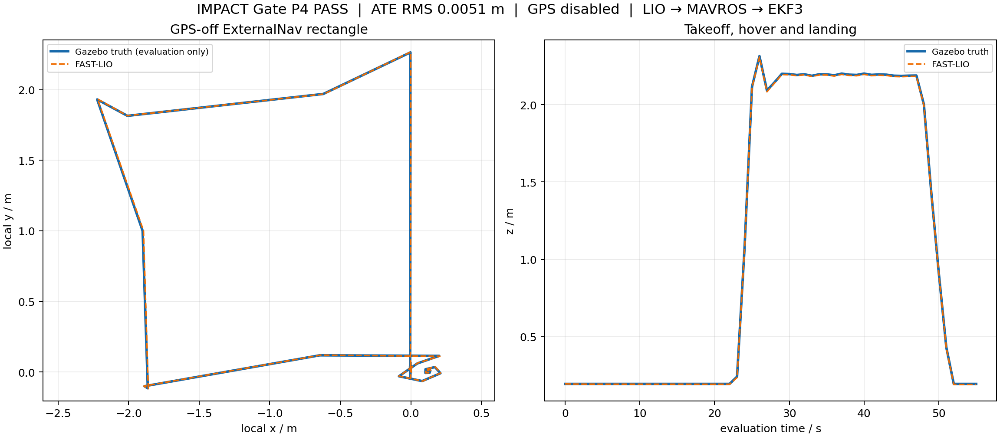

# IMPACT P4 GPS-off ExternalNav 闭环验收报告

验收完成日期：2026-08-23（Asia/Shanghai）

最终证据目录：

`/home/accelerate/xuanqiong_x1_sim_ws/experiments/results/external_nav/p4_20260822T154217Z_10946`

## 结论

Gate P4 为 `PASS`。Gazebo 中的专属 Mid-360-like LiDAR/IMU 经项目本地 FAST-LIO2
产生 `/localization/odom`，再经 MAVROS ODOMETRY 送入 ArduPilot EKF3。GPS 与
SITL GPS 均关闭，飞控完成 GUIDED、解锁、2 m 起飞、悬停、2 m × 2 m 矩形、返回、
降落和自动上锁。任务闭环耗时 102.780 s，终态 `connected=true`、`armed=false`、
`mode=LAND`。

本结论是 Gazebo + ArduPilot SITL + ROS 2 的算法级 SIL 证据，不等同于真实
Mid-360S、真实飞控、Atlas 200I DK A2 或实机无 GPS 飞行证据。



## 闭环与真值边界

控制闭环为：

```text
Gazebo LiDAR/IMU → FAST-LIO2 ESIKF → /localization/odom
→ /uav1/mavros/odometry/out → ArduPilot EKF3 → Guided position controller → UAV
```

ArduPilot 运行时逐项核验：`EK3_SRC1_POSXY/VELXY/POSZ/VELZ/YAW=6`、
`VISO_TYPE=2`、`GPS_TYPE=GPS_TYPE2=0`、`SIM_GPS_DISABLE=SIM_GPS2_DISABLE=1`。
MAVROS 日志明确记录 EKF3 IMU0/IMU1 使用 external nav，并持续记录 `GP: No GPS fix`。

ground truth 只发布到 `/xq/eval/p4/ground_truth`，由评估器消费。话题图证明
FAST-LIO、ExternalNav 适配器和任务控制节点均不订阅该话题；适配器状态也记录
`ground_truth_subscribed=false`。

## 正式 Gate 结果

| 指标 | 结果 | 判定 |
|---|---:|---:|
| 起飞、悬停、矩形、返回、降落 | 全部完成 | PASS |
| 任务闭环墙钟时间 | 102.780 s | 记录 |
| 矩形航点完成数 | 4 / 4 | PASS |
| 终态 | LAND、disarmed | PASS |
| GPS / SITL GPS | 全部关闭 | PASS |
| ExternalNav 输入/输出 | 537 / 537 | PASS |
| ExternalNav 拒绝帧 | 0 | PASS |
| ESKF 速度帧 / 位姿差分回退帧 | 537 / 0 | PASS |
| ExternalNav 末段频率 | 5.038 Hz | PASS |
| FAST-LIO/真值匹配样本 | 554 | PASS |
| ATE RMS | 0.00509 m | PASS |
| 最大位置误差 | 0.01405 m | PASS |
| 偏航误差 RMS | 0.01705° | PASS |
| 1 s 平移 RPE RMS | 0.00323 m | PASS |
| 最大位置步长 | 0.16485 m | PASS |
| 最大估计速度 | 1.6485 m/s | PASS |
| ground truth 泄漏 | 无 | PASS |
| 外部地图/模型变化 | 无 | PASS |

四个 MAVROS 本地坐标航点的到达位置分别为 `(2.216, -0.000, 1.998)`、
`(1.863, 2.229, 1.999)`、`(-0.189, 1.890, 1.999)`、
`(0.096, -0.189, 2.000)` m。航点到达采用 0.45 m 容差并连续驻留 1.5 s，
不是单帧穿越判定。

## 关键算法修正

第一次闭环中，任务节点在 `MAV_CMD_NAV_TAKEOFF` 后继续发送位置设定点，覆盖了
ArduPilot Guided TakeOff 子模式；DataFlash 证明飞控收到 `Cmd=22, Z=2.0`，但没有
形成爬升目标。修正后，`TAKEOFF/ASCEND` 阶段由飞控独占，确认到达高度后才启用
位置设定点。

第二次闭环已起飞，但第一航段在 0–4 m 间发散振荡。DataFlash 中目标位置始终正确，
根因是由 10 Hz 位姿差分并低通得到的速度存在相位滞后。最终由 FAST-LIO ESIKF
直接发布与位姿时间对齐的机体系速度及协方差，ExternalNav 只在该状态不可用时差分
回退。正式轮次 537 帧全部使用 ESKF 速度、0 帧回退，四条 2 m 航段均稳定收敛。

参数服务启动竞态也已处理：MAVROS 参数尚未从 FCU 拉取时返回的
`PARAMETER_NOT_SET` 只触发节流重试；实际参数值与契约不符仍立即失败。

## 证据、构建与隔离

- rosbag：106.271 s、139.5 MiB、74,402 条消息；包含 LiDAR 557、IMU 11,159、
  FAST-LIO odom 554、ExternalNav odom 554、MAVROS local odom 1,024 和评估真值 3,570。
- 源码树 SHA-256：`8f99e813f35d7478af6eb3e5346aec8bca15d2f5d13e1366be597dbcbe34ff22`。
- 安装树 SHA-256：`3276dd376a69b0ea00fefa746cc5c5ab9dcbf1086ab0c5d83e14538730857ba9`。
- P4 单元测试 6/6 通过；SDF 语义检查通过。
- 每轮使用独立 DDS domain、唯一 Gazebo partition、独立 SITL EEPROM/DataFlash 和
  精确进程组；没有全局 `pkill/killall`。
- `/home/accelerate/cuadc_ws`、`/home/accelerate/ardupilot*` 等既有项目资产只读使用，
  运行前后 SHA-256 字节级一致。

## 复现

```bash
cd /home/accelerate/xuanqiong_x1_sim_ws
bash scripts/build_isolated.sh
bash scripts/run_p4_external_nav.sh --minimum-eval-duration 70
```

运行器只有在任务、定位 Gate、真值隔离和外部资产审计全部通过后才生成
`summary.json` 并返回 0。轨迹图可用 `scripts/plot_p4_result.py <结果目录>` 重建。

最终 PASS rosbag 的动态 RViz 复现命令：

```bash
cd /home/accelerate/xuanqiong_x1_sim_ws
bash scripts/view_p4_rviz.sh
```

该脚本以 0.5× 速度播放，Fixed Frame 为 `xq_lio_map`；橙色为 FAST-LIO Path，
蓝色为评估专用对齐真值 Path，彩色点为 LiDAR，绿色箭头为无人机姿态。

## P5 前置边界

P4 PASS 允许按原 IMPACT 执行企划进入 P5 Baseline Map + Frontier + EGO，但不代表
三维地图、前沿探索、EGO-Planner、IMPACT 完整性创新、多机、Atlas 或实机完成。
